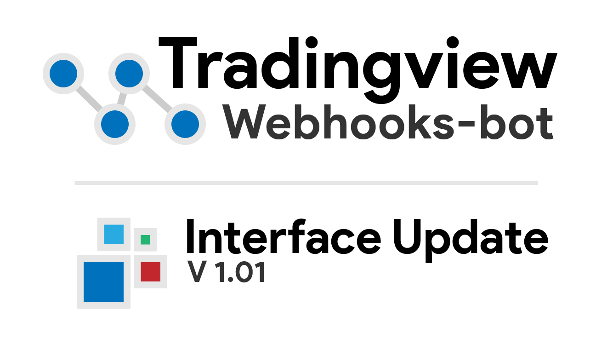

# Tradingview-webhooks-bot

tradingview-webhooks-bot is a trading bot, written in python, that allows users to place trades with tradingview's webhook alerts.

### Webhooks-Bot

The webhooks bot is a simple framework for placing and managing trades with tradingview's webhook alerts.

### Interface

The webhooks-bot interface is an optional extension of the tradingview-webhooks-bot.  It allows for greater control and visualization of webhook alerts.

---

# Getting Started

tradingview-webhooks-bot can be downloaded as a zip or cloned via git (recommended).

### Installing Required Libraries

Once you have downloaded tradingview-webhooks-bot, run the following command `pip install -r requirements.txt`

This will install all the required libraries for tradingview-webhooks-bot to run properly.

### Getting the bot running

In order for the tradingview-webhooks-bot to work, it will need to be running on a computer with open ports.  There are multiple ways to achieve this.  The recommended method is to run the bot on a hosted machine, i.e. AWS, Google Cloud, VPS, etc.  If you do not have one of these, it is possible to use ngrok.  Below are guides on how to get the bot running using these methods.

* hosting service (cloud computers)
* hosting locally (personal computer)

### Usage

Below are links to the wiki, covering how to use tradingview-webhooks-bot.  Before starting, it is recommened to read the short preface.

* actions
* place an order
* advanced orders
* advanced actions

### Interface

The interface is a new way to use the tradingview-webhooks-bot to its full potential.  The interface is an optional GUI that allows for an easier management of webhook alerts.  Interface usage is explained in more detail on the wiki page.
