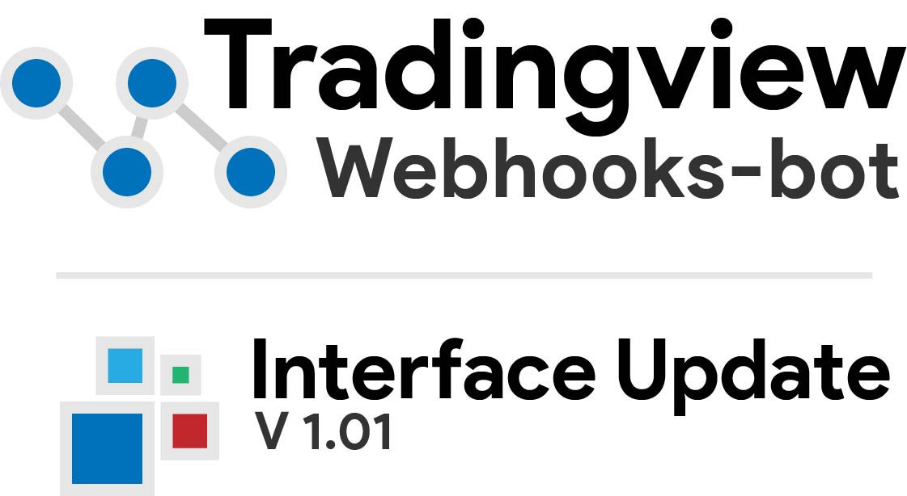

# Tradingview-webhooks-bot

tradingview-webhooks-bot is a trading bot, written in python,
that allows users to place trades with tradingview's webhook alerts.
TVWB comes with two main files, listed below.

### Server

`app/server.py`

The server is a simple framework for placing and managing trades with tradingview's webhook alerts.

### Interface

`app/components/interface.py` (launched with `gui.py`)

The webhooks-bot interface is an *optional* extension of the tradingview-webhooks-bot.  It allows for greater control and visualization of webhook alerts.

---

# Getting Started

### Video Tutorials

For those that prefer video tutorials, I've uploaded a few (work in progress), you can check
them out on the [Video Tutorials Wiki page](https://github.com/robswc/tradingview-webhooks-bot/wiki/Video-Tutorials)!

### Dependencies

* [Python (3.8+)](https://www.python.org/downloads/)
* Flask
* Dash (optional, interface only)

### Downloading

tradingview-webhooks-bot can be downloaded
as a zip [or cloned via git](https://git-scm.com/book/en/v2/Git-Basics-Getting-a-Git-Repository) (recommended).

### Installing Required Libraries

Once you have downloaded tradingview-webhooks-bot, run the following command 

`pip install -r requirements.txt` within the `tradingview-webhooks-bot` directory.

This will install all the required libraries for
tradingview-webhooks-bot to run properly.

*If you're familiar with python and pip, its recommended to use pipenv for this step!*

### Getting the bot running

In order for the tradingview-webhooks-bot to work, it will need to be running on a computer with open ports.  
There are multiple ways to achieve this. The recommended method is to run the bot on a server, i.e. AWS, Google Cloud, VPS, etc. 
**If you do not have one of these, it is possible to use ngrok.** Below are guides on how to get the bot running using either method.
Since the bot is built with [Flask](https://flask.palletsprojects.com/), **any method to deploy a flask app will work.**

* [Hosting with server](https://flask.palletsprojects.com/en/2.0.x/deploying/index.html) (AWS, Digital Ocean, VPS, etc)
* [Hosting locally](https://github.com/robswc/tradingview-webhooks-bot/wiki/Using-Ngrok) (personal computer)

### Usage

I would highly recommend visiting the *Getting Started* wiki page
and following the *Simple Webhook Event* tutorial.  This will get you
familiar with tradingview-webhooks-bot, enough to then create your own stuff!

* [Getting Started](https://github.com/robswc/tradingview-webhooks-bot/wiki/Getting-Started)

* [Simple Webhook Event Tutorial](https://github.com/robswc/tradingview-webhooks-bot/wiki/Simple-Webhook-Event-Tutorial)

* [Simple Interface Tutorial](https://github.com/robswc/tradingview-webhooks-bot/wiki/Simple-Interface-Tutorial)

*If anyone wants to volunteer to create more tutorials/documentation, please let me know - Thanks!*

### Interface

The interface is a new way to use the tradingview-webhooks-bot to its full potential.
The interface is an optional GUI that allows for an easier management of webhook alerts.
Interface usage is explained in more detail on the [wiki page](https://github.com/robswc/tradingview-webhooks-bot/wiki/Interface-GUI).

* [Simple Interface Tutorial](https://github.com/robswc/tradingview-webhooks-bot/wiki/Simple-Interface-Tutorial)

---

# Contributing

For fans of TVWB, please consider contributing to the project!  At the moment, we need more documentation.
Please let me know in a discussion or DM if you want to add some documentation or learning materials.

Thanks!

